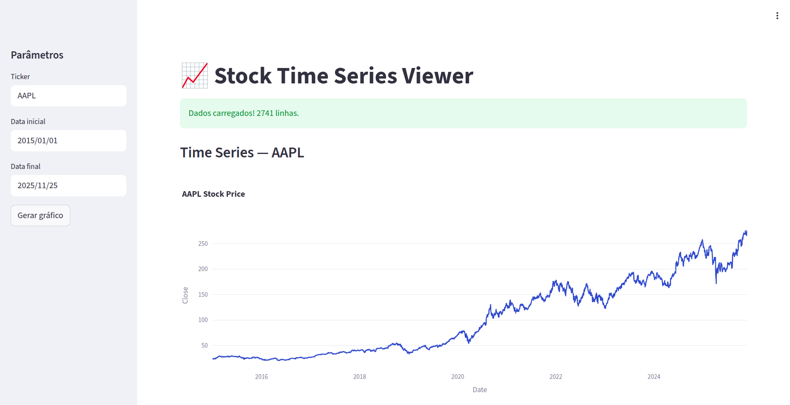

# DS_PROJECT

This is a complete Data Science/MLOps project. 

## Installation

Install poetry

```{bash}
pipx install poetry 
poetry config virtualenvs.in-project true --local
poetry init
```

Activate venv

```
 source .venv/bin/activate
```

## Run the dsproject app

```
import dsproject as dsp
dsp.run_dsproject_app()
```

